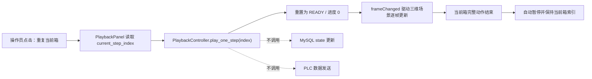

# “重复当前箱”按钮设计

## 目标

在机器人三维系统底部播放控制条中增加独立的“重复当前箱”按钮。操作员点击后，
系统从 `READY` 阶段重新播放当前选中箱子的完整三维动作，动作结束后自动暂停，
并保持当前箱选中。

该功能仅用于三维动画复看，不重新读取或修改 MySQL 数据，不改变箱子 `state`，
也不向 PLC 重发任何数据。

## 交互行为

按钮放在现有“播放/暂停”按钮右侧，文字为“重复当前箱”。

点击按钮时：

1. 以 `PlaybackController.current_step_index` 作为当前箱索引。
2. 如果当前正在播放，先停止当前播放进度。
3. 将当前箱重置到 `READY`、进度 `0.0`。
4. 依次播放该箱的全部抓取、搬运、放置和回撤阶段。
5. 最后一个阶段结束后自动暂停，不前进到下一箱。

如果当前没有可播放的箱子，点击不执行任何动作，也不产生数据库或 PLC 副作用。

## 数据流

## 模块改动

### `packing_ui/playback.py`

- `PlaybackPanel` 新增公开控件 `replay_button`。
- 新增面板内部点击处理方法，在点击发生时读取控制器的当前索引，并调用
  `play_one_step(current_step_index)`。
- 继续复用现有 `PlaybackController.play_one_step` 的单箱播放和结束自动暂停
  逻辑，不复制第二套动画状态机。

### 不改动的模块

- `packing_ui/main_window.py`：无需新增数据库或 PLC 调用。
- 数据库读取与 `state` 同步模块：不参与动画重播。
- PLC 协议与发送线程：不参与动画重播。

## 边界与安全性

- 当前箱由播放控制器的当前索引决定，与列表选择和播放滑块保持一致。
- 播放到一半再次点击时，从该箱 `READY` 阶段重新开始。
- 重播完成后仍停留在同一箱，不自动播放下一箱。
- 功能不会创建现场指令，不会更改数据库状态，不会触发 PLC 握手或重发。
- 普通“播放/暂停”、上一箱、下一箱和速度选择功能保持不变。

## 测试与验收

采用测试驱动方式补充以下覆盖：

1. UI 冒烟测试确认“重复当前箱”按钮存在。
2. 点击测试确认按钮把当前控制器索引传给 `play_one_step`。
3. 控制器测试确认当前箱从 `READY` 重新开始。
4. 控制器测试确认完整动作结束后自动暂停且索引不变。
5. 运行 `packing-robot` 相关测试，确认原有播放和界面行为没有回归。

验收标准是：任意选择一个箱子后点击“重复当前箱”，只看到这一箱从头完整播放一次，
结束后暂停；数据库和 PLC 均没有新增操作。
